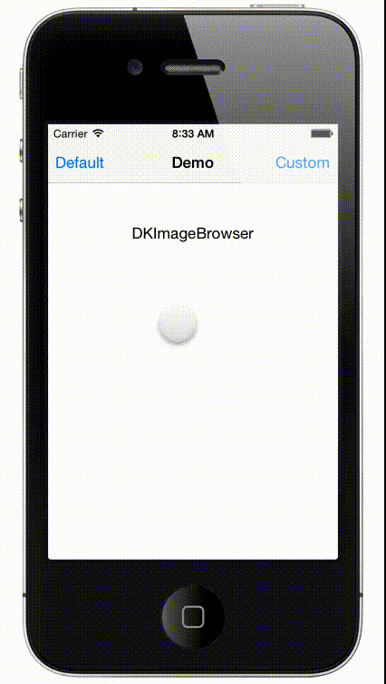

DKImageBrowser
==============

iOS controller to display images (URL or `UIImage`) alongside a strip of thumbnails

[](https://travis-ci.org/dkhamsing/DKImageBrowser)
[](https://cocoapods.org/pods/DKImageBrowser)
[](http://cocoadocs.org/docsets/DKImageBrowser)
[](http://cocoadocs.org/docsets/DKImageBrowser)



# Installation
## Manual
- Drag `DKImageBrowser/DKImageBrowser` to your project.
- `#import "DKImageBrowser.h"` (or `#import "DKModalImageBrowser.h"`)

## [CocoaPods](https://cocoapods.org/)
``` ruby
platform :ios, '9.0'
pod 'DKImageBrowser'
```

# Usage
Set up the data source array and pass it to an instance of `DKImageBrowser`.

```  objc    
    DKImageBrowser *imageBrowser = [[DKImageStripController alloc] init];
    imageBrowser.DKImageDataSource =  @[ @"http://placekitten.com/230/400",
                                  	     @"http://placekitten.com/240/400"], ];
    [self.navigationController pushViewController:imagesController animated:YES];

```

The data source `DKImageDataSource` can also be a list of `UIImage` objects.

``` objc
    imageBrowser.DKImageDataSource = @[ [UIImage imageNamed:@"400-1.jpg"],
                                        [UIImage imageNamed:@"400-2.jpg"], ];
```
                                  
To present the controller modally, use `DKModalImageBrowser`.

``` objc
    DKModalImageBrowser *modalImageBrowser = [[DKModalImageBrowser alloc] init];    
    // note: use modalImageBrowser.imageBrowser to set data source, customize
    modalImageBrowser.imageBrowser.DKImageDataSource = @[ [UIImage imageNamed:@"400-1.jpg"],
                                                          [UIImage imageNamed:@"400-2.jpg"], ];
    [self presentViewController:modalImageBrowser animated:YES completion:nil];

```

## Swift

``` swift
 	func actionDefault() {
        let imageBrowser = DKImageBrowser()
        imageBrowser.title = "UIImage Data Source"
        
        let imageDataSource: [UIImage] = [
            UIImage(named: "400-1.jpg")!,
            UIImage(named: "400-2.jpg")!,
        ]
        imageBrowser.DKImageDataSource = imageDataSource
        
        self.navigationController?.pushViewController(imageBrowser, animated: true)
    }
    
    func actionCustom() {
        var kittenDataSource: [NSString] = []
        let imageHeight = 416
        let imageWidth = Int(self.view.bounds.size.width - 20)
        
        for index in 1...10 {
            let placeKitten = "http://placekitten.com/\(imageWidth + (index * 2  + 10))/\(imageHeight)" as NSString
            kittenDataSource.append(placeKitten)
        }
        
        let modalImageBrowser = DKModalImageBrowser()
        modalImageBrowser.title = "URL Data Source"
        
        modalImageBrowser.imageBrowser.DKImageDataSource = kittenDataSource
        modalImageBrowser.imageBrowser.DKImagePadding = 5
        modalImageBrowser.imageBrowser.DKThumbnailStripHeight = 110
        modalImageBrowser.imageBrowser.DKBackgroundColor = UIColor.blackColor()
        modalImageBrowser.imageBrowser.DKThumbnailStripPosition = 0
        modalImageBrowser.imageBrowser.DKStartIndex = 2
        
        self.presentViewController(modalImageBrowser, animated: true, completion: nil)
    }

```

## Customization
- `DKBackgroundColor` Background color of the image browser. The default is white.
- `DKImagePadding` Padding around the images. The default is 20.
- `DKImageWidth` Width of the main image being displayed. The default is the width of the screen -100.
- `DKStartIndex` Starting image index. The default is 0 (first image).
- `DKThumbnailStripHeight` Height of the thumbnail strip. The default is 100.
- `DKThumbnailStripPosition`  Position of the thumbnail strip, either `DKThumbnailStripPositionTop` or `DKThumbnailStripPositionBottom`. The default is `DKThumbnailStripPositionBottom`.

# Demo
DKImageBrowser includes Swift and Objective-C demo projects.

# Compatibility
This project was tested with iOS 9.

# Contact
- [github.com/dkhamsing](https://github.com/dkhamsing)
- [twitter.com/dkhamsing](https://twitter.com/dkhamsing)

# License
DKImageBrowser is available under the MIT license. See the [LICENSE](LICENSE) file for more info.
